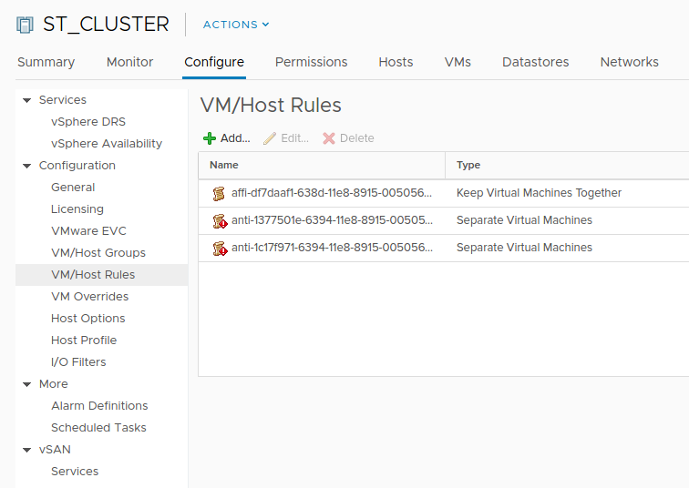

# Introduction to vsphere-affinity-scheduling-plugin

## Kubernetes scheduler

[Scheduler][scheduler] is one of the critical components in Kubernetes. It tries
to optimize the placements of all workloads, pods in Kubernetes, and meet a
set of pre-defined constraints and policies, in order to achieve availability,
performance and capacity. Some of the constraints are resource constraints, like
how much CPU/memory the pod requires to run, the scheduler will try to place the
pod to the node with sufficient resource available, and still make the whole
cluster's resource well utilized. Some of the policies are affinity/anti-affinity,
like some pod has to run on specific node, etc. Those policies are critical to
the applications that has availability requirements.

## Affinity and Anti-Affinity policies

Kubernetes scheduler has a feature, still in beta up til the moment when this doc
is written, that allows user to specify the [affinity/anti-affinity][kube-affinity]
on pods. There are 2 kinds of affinity/anti-affinity:

- node affinity
- inter-pod affinity and anti-affinity.

As the name implies, node affinity specifies the affinity between pod and node;
while inter-pod affinity and anti-affinity specifies it between pods. For more
details, refer to the [official document][kube-affinity] on how it works. In
this document we will focus on inter-pod affinity and anti-affinity.

### Scheduling on hypervisor

Kubernetes support a wide range of cloud providers, including public cloud like
AWS, GCE, Azure, as well as on-premise solutions like VMware vSphere and OpenStack.
No matter it's public cloud or private cloud, most of the deployments prefer virtual
machines on top of hypervisor instead of bare metal, because of the management cost
for machines of bare metal is a lot higher.

The problem for hypervisor is that the Kubernetes doesn't differentiate nodes on
virtual machine and bare metal, which would cause problems when scheduler tries
to schedule workload. One of the typical problem is the affinity/anti-affinity
policy, because the rule might mean different from the user's intention.

Most of the time, when user chooses to set affinity/anti-affinity rule for these
reasons:

- Affinity: for adjacency. For example, make 2 pods together, so the communication
between them is not traveling externally.
- Anti-affinity: for availability. For example, make master node and standby node
on different host, so that losing one node doesn't bring down the service because
the the service will be failed over to the standby node.

Among these typical use cases, anti-affinity is obviously very important. However,
there is no direct support in Kubernetes to support physical host level inter-pod
affinity/anti-affinity policy. That's also the main reason VMware develops this
plugin to support this.

### An example

Here is an example for inter-pod anti-affinity for Kubernetes on vSphere.


As it is showed in the diagram, pod _p3_ is deployed with anti-affinity rule to
_p1_, which is running on _node1_, which is running on physical host _host1_.
The user doesn't want _p3_ and _p1_ to be running on the same host.


What Kubernetes could end up is scheduler sees _node2_ as a different node from
_node1_, and place the pod on _node2_. However, it's obviously not an ideal node,
because both _node1_ and _node2_ are running on the same physical host _host1_.
When _host1_ goes down, both _node1_ and _node2_ are lost, and the application
becomes unavailable. This is probably not what the user really wants.

## vSphere affinity scheduling plugin

Kubernetes scheduler doesn't have enough information to do physical host level
inter-pod affinity/anti-affinity scheduling. The purpose of this plugin is to
work as a bridge to collect information from both Kubernetes and vSphere, and
faciliate the Kubernetes scheduler to do physical host level inter-pod
affinity/anti-affinity scheduling. This plugin has 3 components.

### Node Labeller

Node labeller is the component that monitors the virtual machines running in
vSphere and labels all the Kubernetes node with the physical host it is running
on. It labels the node with keyword `alpha.cna.vmware.com/host`. Node Labeller
will detect any changes both from vSphere and Kubernetes, and update the label
accordingly. For instance, when a new node is added to Kubernetes cluster, or
a node is migrated to another physical host either manually or automatically
triggered by DRS.

A typical short version of node looks like the following:

```yaml
apiVersion: v1
kind: Node
metadata:
  name: sc-rdops-vm04-dhcp-125-28.eng.vmware.com
  labels:
    alpha.cna.vmware.com/host: 10.160.108.174
    beta.kubernetes.io/arch: amd64
    beta.kubernetes.io/os: linux
    kubernetes.io/hostname: sc-rdops-vm04-dhcp-125-28.eng.vmware.com
```

It means this Kubernetes node `sc-rdops-vm04-dhcp-125-28.eng.vmware.com` is
running on a physical host (ESX server) named `10.160.108.174`. This label can
be used to for inter-pod affinity/anti-affinity policy for scheduler. It will
be described later.

### DRS rule translater

vSphere also has a well-known scheduler called [DRS][DRS] (Distributed Resource
Scheduler). When you have 2 schedulers (Kubernetes and vSphere) in the same
system, one of the things we need to make sure is they are not working against
each other. For example, DRS has lots of amazing features, one of which is
called *automated load balancer*. What it tries to do is, it will detect the
workload imbalance among the physical hosts, and automatically migrate the VMs
between physical host to balance the workload. However, when DRS decides to
migrate a VM to another host, it knows nothing about any inter-pod
affinity/anti-affinity policies configured in Kubernetes cluster. It will
potentially break the rules.

What DRS rule translater will do is it will translate the inter-pod
affinity/anti-affinity rules into a DRS inter-VM affinity/anti-affinity rules,
and configure them into vSphere cluster. When DRS kicks in, it knows those VMs
that has to be placed on the same host or different hosts, because there are
some Kubernetes pods with similar rules configured. This configuration is
available on UI when you click throught cluster => Tab "Configure" =>
Configuration => VM/Host Rules, as show here:



For example, in the previous diagram. Imagine _p1_ and _p2_ has anti-affinity
rule configured between each other. The DRS rule translater will configure the
DRS to have an anti-affinity rule for VM _node1_ and _node3_, so DRS will never
migrate _node3_ to _host1_ which will break the anti-affinity beween _p1_ and
_p2_,and vice verse.  

### http extender

This plugin also provides an http extender for Kubernetes scheduler to consume.
It doesn't provide additional functionality, but only another option for
deployment. It's intention is to provider faster cache and better performance.
With improved performance from Kubernetes default scheduler, this extender
might be deprecated in future.

## How to use this plugin

Install the latest plugin by running:

```console
go get -u github.com/vmware/vsphere-affinity-scheduling-plugin
```

Get the help by `./vsphere-affinity-scheduling-plugin -h`. The important options
are:

- -cluster: vSphere cluster name to setup affinity/anti-affinity rules
- -url: vCenter URL
- -port: the port for http extender to listen

The plugin will look at env `$KUBECONFIG` and service account token to get the
credentials to talk to Kubernetes.

We currently don't release docker image for this plugin. However, you can build
the image on your own pretty easily. Just go to `docker` folder and run `make`.
Upload the image to any docker registry and you should be able to use it in your
cluster.


[scheduler]: https://kubernetes.io/docs/reference/command-line-tools-reference/kube-scheduler/
[kube-affinity]: https://kubernetes.io/docs/concepts/configuration/assign-pod-node/#affinity-and-anti-affinity
[DRS]: https://www.vmware.com/products/vsphere/drs-dpm.html
[scheduler-extender]: https://github.com/kubernetes/community/blob/master/contributors/design-proposals/scheduling/scheduler_extender.md
[plugin]: https://github.com/vmware/vsphere-affinity-scheduling-plugin
